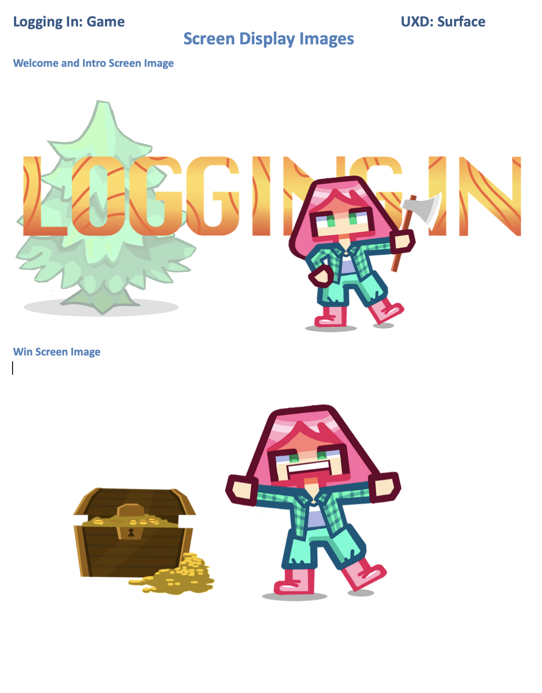

# Logging-In
## A Game for LumberJacks and LumberJackies using JavaScript
All art work was created for this project by Sarah Rae and is used with permission. All copyrights artwork used in this project are owned and reserved by Sarah Rae. 

You can play Logging-In [here.](https://mikerae.github.io/logging-in-game/)
## Contents
+ [User Experience Design - UXD](#user-experience-design "User Experience Design")
    + [Strategy](#strategy "Strategy")
        + Stakeholder Stories
    + [Scope: Development Stage 1](#scope:-development-stage-1 "Scope")
  + [Future Development](#future-development "Future Development")
    + [Scope: Development Stage 2](#scope:-development-stage-2 "Scope")
    + [Scope: Development Stage 3](#scope:-development-stage-3 "Scope")
    + [Scope: Development Stage 4](#scope:-development-stage-4 "Scope")
    + [Scope: Development Stage 5](#scope:-development-stage-5 "Scope")
    + [Scope: Development Stage 6](#scope:-development-stage-6 "Scope")
    + [Scope: Development Stage 7](#scope:-development-stage-7 "Scope")
    + [Scope: Development Stage 8](#scope:-development-stage-8 "Scope")
    + [Scope: Development Stage 9](#scope:-development-stage-9 "Scope")
    + [Scope: Development Stage 10](#scope:-development-stage-10] "Scope")
    + [Scope: Development Stage 11](#scope:-development-stage-11] "Scope")
    + [Structure](#structure "Structure")
    + [Skeleton](#skeleton "Skeleton")
        + Wire Frames
    + [Surface](#surface "Surface")
    + [Screen Flow Logic](#screen-flow-logic)
+ [Development](#development)
  + [Git Hub Repository](#git-hub-repository)
  + [IDE](#ide)
  + [Version Tracking: Git Commit](#version-tracking-code-comments)
  + [Git Push: GitHub](#git-push-github)
  + [Local Web Page viewing](#local-web-page-viewing)
  + [Creating 12 Column Grid Layout](#creating-12-column-grid-layout)
  + [External Resources](#external-resources)
  + [Global Scope, Lexical Scope, Closure, Block Scope, Function parameters](#global-scope-lexical-scope-closure-block-scope-function-parameters)
+ [Deployment](#deployment)
+ [Bugs and Resolutions](#bugs-and-resolutions)
  + [Image does not display in #display-img-wrapper in js](#image-does-not-display-in-display-img-wrapper-in-js)
  + [Multiple images display in the welcome screen when Nav item 'Quit' is clicked](#multiple-images-display-in-the-welcome-screen-when-nav-item-quit-is-clicked)
  + [Buttons not populating with text or event - Bug 1](#buttons-not-populating-with-text-or-event---bug-1)
  + [Buttons not populating with text or event - Bug 2](#buttons-not-populating-with-text-or-event---bug-2)
  + [Screen Flow rebuild bug 1](#screen-flow-rebuild-bug-1)
  + [Display Issues](#display-issues)
  + [Functions only return one value](#functions-only-return-one-value)
  + [TARGETPROFIT  became 'undefined'](#targetprofit-became-undefined)
  + [tiles became 'undefined'](#tiles-became-undefined)
  + [Map overpopulates with tile images when multiple New Games are started](#map-overpopulates-with-tile-images-when-multiple-new-games-are-started)
  + [LumberJackie not displaying](#lumberjackie-not-displaying)
  + [Maptile images don't populate after Welcome/Intro buttons are pressed but do populate when New game is selected in the nav bar](#maptile-images-dont-populate-after-welcomeintro-buttons-are-pressed-but-do-populate-when-new-game-is-selected-in-the-nav-bar)
  + [Map Grid shows horizontal gaps between rows](#map-grid-shows-horizontal-gaps-between-rows)
  + [Tile Response to event Listeners is unacceptably slow](#tile-response-to-event-listeners-is-unacceptably-slow)
  + [Next Tile Eventlisteners In Actions Menu are not yet corresponding to new current tile](#next-tile-eventlisteners-in-actions-menu-are-not-yet-corresponding-to-new-current-tile)
  + [move is called() when the CurrentTileId tile is clicked again](#move-is-called-when-the-currenttileid-tile-is-clicked-again)
  + [Eventlisteners for Game mechanics Actions firing immediately and not waiting for event](#next-tile-eventlisteners-in-actions-menu-are-not-yet-corresponding-to-new-current-tile)
  + [Move() not updating CurentTile](#move-not-updating-curenttile)
  + [setActionEventList() failing on HarvestForest](#setactioneventlist-failing-on-harvestforest)
  = [Eventlisteners for Game mechanics Actions firing multiple times](#eventlisteners-for-game-mechanics-actions-firing-multiple-times)
  + [remove ActionEventListeners() not working](#remove-actioneventlisteners-not-working)
  + [Eventlisteners for LumberJackie hove/unhover firing multiple times and behaving unpredictably](#eventlisteners-for-lumberjackie-hoveunhover-firing-multiple-times-and-behaving-unpredictably)
  + [LumberJackie not hidding when moving from current tile to next tile](#lumberjackie-not-hidding-when-moving-from-current-tile-to-next-tile)
  + [LumberJackie still showing on some tiles when New Game is selected](#lumberjackie-still-showing-on-some-tiles-when-new-game-is-selected)
+ [Testing](#testing)
  + [Human Testing and Development Feedback](#human-testing-and-development-feedback)
  + [Jshint](#jshint)
  + [W3 HTML Validator](#w3-html-validator)
  + [W3 CSS Validator](#w3-css-validator)
  + [Lighthouse Analytics](#lighthouse-analytics)
  + [Am-I-Responsive](#am-i-responsive)
  + []


  


+ [Technologies Used](#technologies-used "Technologies Used")
    + HTML5
    + CSS3
    + GitPod
    + Git
    + GitHub
+ [Testing and Resulting Issues](#testing-and-resulting-issues "Testing and Resulting Issues")
    + Human Testing
    + Developer Tools
    + Amiresponsive site
    + Validator Testing
    + Lighthouse Accessibility Testing
+ [Known Issues](#known-issues "Known Issues")
+ [Development and Deployment](#development-and-deployment "Development and Deployment")
    + IDE
    + Version Control
    + GitHub
    + GitHub Pages
    + External Resources
    + Development Issues
+ [Credits](#credits "Credits")
    - Content
    - Media
    - Code
    - Feedback
## UXD
### Strategy
##### [Back to Top](#contents "Contents")  

### Scope: Development Stage 1
##### [Back to Top](#contents "Contents")
####  Minimum Viable Product


After the initial consultation with my mentor, it was decided to plan  development in stages.
The first stage aims to fulfil all pass criteria for the Code-Institute Portfolio Project 2, and presents the game in its simplest form.  

It was not possible to progress further than Stage 1 in the time allowed.
Whilst the game is not 100% bug free for stage 1, Once it is, progress through the olther
stages should be mostly smooth.
### Use of Libraries
It was advised, given the ambitious scope of the various development stages, and limited time resource to make full use of libraries, eg Bootstrap and JQuery etc.
After consideration it was decided not to significantly use libraries for stage 1. The rationale is after feedback from the assessment of Portfolio Project 1 there was room for improvement in UXD, HTML and CSS. It is hoped that this improvement can be made through stage 1 without resorting to the use of libraries. This use of raw HTML CSS and JavaScript can be demonstrated and assessed up to the final commit for Stage 1.
### Scope: Future Development
### Scope: Development Stage 2
##### [Back to Top](#contents "Contents") 

### Scope: Development Stage 3
##### [Back to Top](#contents "Contents") 

### Scope: Development Stage 4
##### [Back to Top](#contents "Contents") 

### Scope: Development Stage 5
##### [Back to Top](#contents "Contents") 

### Scope: Development Stage 6
##### [Back to Top](#contents "Contents") 

### Scope: Development Stage 7
##### [Back to Top](#contents "Contents") 

### Scope: Development Stage 8
##### [Back to Top](#contents "Contents") 


### Scope: Development Stage 9
##### [Back to Top](#contents "Contents") 


### Scope: Development Stage 10
##### [Back to Top](#contents "Contents") 

### Scope: Development Stage 11
##### [Back to Top](#contents "Contents") 

### Structure
##### [Back to Top](#contents "Contents") 

### Skeleton
##### [Back to Top](#contents "Contents")
### UXD Responsive Design
Guidance on building a responsive Grid View was obtained from [W3 Schools](https://www.w3schools.com/css/css_rwd_grid.asp).

For this project it was decided to design from the smallest screen upwards.
Three columns with 15px padding were used for extra small screens:


Twelve narrow columns were used for small screens:


Twelve wider columns were used for larger screens:


The Outer Wrapper in the index.html file is set to the width and height of the viewport. It ensures that all elements within it are contained within the user's screen size, and forms the foundation to the sites responsiveness.

All elements underneath the Navbar are contained within one of two display wrappers. These wrappers are styled with 12 columns for small to large screens and 3 columns for extra small screens. The width of these columns are a fraction of the width of the screen. These columns form the layout grid for all elements within these display sections.

Using columns on this way ensures that as the width of the screen changes, so do all the elements contained within. The elements remain in proportion to each other as they change size.

##### [Back to Top](#contents "Contents")

##### [Back to Top](#contents "Contents")

##### [Back to Top](#contents "Contents")

##### [Back to Top](#contents "Contents")

##### [Back to Top](#contents "Contents")

##### [Back to Top](#contents "Contents")
### Surface
##### [Back to Top](#contents "Contents")
## Original Art Work
All art work was created for this project by Sarah Rae and is used with permission. All copyrights artwork used in this project are owned and reserved by Sarah Rae. 

##### [Back to Top](#contents "Contents")

##### [Back to Top](#contents "Contents")

##### [Back to Top](#contents "Contents")

##### [Back to Top](#contents "Contents")

##### [Back to Top](#contents "Contents")

##### [Back to Top](#contents "Contents")

##### [Back to Top](#contents "Contents")
## Screen Flow Logic
##### [Back to Top](#contents "Contents")


## Development
##### [Back to Top](#contents "Contents")
### Git Hub Repository
A repository for this project was created on GitHub using a template from the Code Institute. This created a development environment in GitPod containing all the resources needed for project development.
### IDE
##### [Back to Top](#contents "Contents")
The Integrated Development Environment used was Git Pod which is a web browser deployment of the VS Code IDE.
### Version Tracking: Git Commit
##### [Back to Top](#contents "Contents")
Git Commit was used extensively to incrementally record each atomic development step. The use of Summary Lines and Body text in these commits helped towards keeping the purpose and detail of each commit easily understandable.
### Version Tracking: Code Comments
##### [Back to Top](#contents "Contents")
Comments were used extensively in HTML, CSS and JS files to clearly mark each section of code in order to facilitate future maintenance and development.
### Git Push: GitHub 
##### [Back to Top](#contents "Contents")
The project was incrementally pushed to GitHub, ensuring that all commits were stored on GitHub.
### Local Web Page viewing
##### [Back to Top](#contents "Contents")
A local python HTTP server was deployed via the GitPod terminal and the project was viewed in a local browser tab during all stages of development.git push
### Creating 12 Column Grid Layout
##### [Back to Top](#contents "Contents")
box-sizing: boarder-box was used to ensure all grid boxes as sized to include padding and border.
12 classes were created for elements with widths of 1/12 of the screen width i.e. 100%/12 = 8.33%.
Each column floats left, has padding of 15px and for layout purposes initially has a border. The css attribute selector "[attribute*=value]" was used to target all classes (attribute) with value "col-" in order to apply this styling.
Column classes were applied to the html Nav and DisplayScreen sections.

After this learning experience, it was discovered that to use the float/clear and col- width method has been superseeded by flex, flexbox and grid css methods. Flex and grid were brought into the css as the build progressed.
### External Resources
##### [Back to Top](#contents "Contents")
The following reference sites were used extensively throughout development:
- 
- 
- 
Other sites were used via goole searches as required.
### Global Scope, Lexical Scope, Closure, Block Scope, Function parameters
##### [Back to Top](#contents "Contents")
There were Several instances where variables within a function threw the error that they were not defined.
Initially, this was because the variable had not been passed into the function as a parameter. The fix was to pass it as a parameter.
However, this lead to the need to repetitively pass the same parameters to many functions.
After discussion and research it was suggested that there might be a better solution, perhaps using 'Closure'. After research it became clear that 'closure' was a complex concept and not necessarily the way forward. However the concept of 'lexical scope' became increasingly visible.
A conversation with a Student Tutor suggested that the only way to avoid repetitively passing multiple parameters into function was to initialise these variables with global scope, i.e. outside everything. It was suggested that in the context of this game, the risk of global variables behaving unpredictably was negligible.

The variables in question were initialised as global, and the function parameters were cleaned up. The game continued to be developed.

However, further research suggested that 'Lexical Scope' i.e. initialising variables within an enclosing function , and also having all the functions for which they needed to be visible within the same enclosing function would provide the solution [The solution needed was for these variables to be accessible to all called functions without passing them as parameters, but not accessible outside the enclosing function to prevent unpredictable behaviour].

The variables were put back inside the encapsulating function main(), and all of the game functions were also placed inside main().
Everything worked fine. Lexical Scope provided the solution.

## Deployment
##### [Back to Top](#contents "Contents")
At the appropriate stage in development, the GitHub repository was deployed to GitHub Pages for public viewing via the GitHub server. The main repository was selected and an http link was generated and displayed in the repository Readme.md.

## Bugs and Resolutions
##### [Back to Top](#contents "Contents")
### Image does not display in #display-img-wrapper in js
#### Status: Resolved
The path was tested by hard coding an img element within the wrapper div. The image loaded.
Next, the css style link was tested by hard coding it into the  element. It was found that a class identifier was used instead of an id identifier. When corrected the style was applied correctly.
Next, the  element was deleted in the html file. The image did not load => the bug is in function: populateScreen() or the object: WELCOME.
Next, the object: WELCOME was tested.
Resolution: The css identifier was incorrectly applied to object Screens. A class identifier was used in the css file and the setAttribute, but an id identifier was needed. The Screens key was changed to cssid for clarification, the identifier in the css file was changed from .screen-image to #screen-image and the function line in loadImage(Screens) was changed to image.setAttribute("id", Screens.cssid)
### Multiple images display in the welcome screen when Nav item 'Quit' is clicked
#### Status: Resolved
##### [Back to Top](#contents "Contents")
The loadImage() function was amended to check for the presence of a live  in the HTMLcollections list for the image container. If found, it was removed until hHTMLcollection was empty. Then the required image was loaded using values from the Screens object.
This functionality will become significant during the main game loop.
### Buttons not populating with text or event - Bug 1
#### Status: Resolved
##### [Back to Top](#contents "Contents")
Console error shows: Uncaught ReferenceError: WELCOME is not defined
    at populateButtons (script.js:144)
    at populateScreen (script.js:117)
    at loadScreen (script.js:78)
    at main (script.js:49)
The screen toggled correctly, the image was loaded and text was correctly loaded, therefore the problems begin at populateButtons.
WELCOME was tested be defined using console.log(Screens) at the start of the function populateButtons().
WELCOME is correctly passed into populateButtons().
It became clear that the condition (Screens === WELCOME) needed to be replaced by (Screens.name === "welcome"). This corrected the first level of error so that text loaded into the button. The other similar conditions in the function were amended accordingly.
### Buttons not populating with text or event - Bug 2
#### Status: Resolved
##### [Back to Top](#contents "Contents")
The eventListener to load the next screen when button 1 was clicked did not work. Console.log(Event) was undefined.
```Button1.addEventListener("onclick", function()...```
After checking the syntax of the onclick was changed to:
```Button1.addEventListener("click", function()...```
Console.log(Event) returned an event.
```script.js:147 ƒ Event() { [native code] }```
The next page still did not load.
The variable nextScreen was tested with at the end of populateButtons().
```console.log(nextScreen);``` returned undefined, but should have returned "intro".
The variable nextScreen was tested with at the  eventListener of populateButtons().
```
if (Screens.name === "welcome") {
      button1.innerText = Screens.btn1txt;
      button1.addEventListener("click", function() {
        nextScreen = "intro";
        console.log(nextScreen);
```
Console.log(nextScreen) was not called => the eventListener function was not called. The syntax of the eventListener was checked.

The Logic of the screen flow was reconsidered and it was decided to redesign the flow og the program. A temporary file temporarycode.js was created and contents of script.js was copied.
Here is the commit message for this stage of development:

```
The button eventListener action were not working because the flow
logic of the program is flawed.
A summary of the redesigned flow is as follows:

After initialisation selectScreen(......) is called.
Its behaviour is controlled by the value of nextScreen.
selectScreen(.....) calls the following:
  setScreen(....) sets the screen object
  displayScreen(....) calls all the screen utilities
  setEventListeners(....) adds event Listeners to screen and nav buttons

Event functions are then called as screen or nav buttons are pressed.

Event functions are:
  quit()  sets nextScreen to "welcome' and calls selectScreen()
  playNow() sets nextScreen to "intro' and calls selectScreen()
  newGame() sets nextScreen to "game' and calls selectScreen()
  win() sets nextScreen to "win' and calls selectScreen()

  The initialisegame() function and rungame() main game loop are called
  within displayScreen() when nextscreen = "game" and selectScreen() is
  called.
  ```
### Screen Flow rebuild bug 1
#### Status: Resolved
##### [Back to Top](#contents "Contents")
The rebuild progressed well until the screen display utilities (except button content and event listeners) were copied and amended. The screen object was  undefined.
Solution: In the setScreen function the 'break' instruction was replaced with 'return screen', and screen was set to receive this functions output. 
### Display Issues
#### Status: Resolved:
##### [Back to Top](#contents "Contents")
The positioning is messed up in smaller screen sizes.
This is caused by incomplete understanding of flex and flexbox, and mixing an older layout technique using floats and clears.
More research is needed to gain a better understanding of these features.
The full screen gradient is currently a background image which does not load on the  gitHub pages server.
The gradient image was replaced with "background: liniar-gradient" to solve the issue.
### Functions only return one value
#### Status: Resolved
##### [Back to Top](#contents "Contents")
For the function sellLogs(stockProfit, SELLLOGS), I needed a function which, when called by an event, would sell the current stock of logs for a profit,  increase the profit variable and decrease the logsInstock variable. This is not possible directly in JavaScript because a function can only return one value. The work-around was to combine the profit and logsInStock variables int one object "stockProfit".
The function applied its calculations to the stockprofit.profit and stockprofit.logsInStock and returned the stockProfit object.
### TARGETPROFIT  became 'undefined'
#### Status: Resolved
##### [Back to Top](#contents "Contents")
The order of function arguments was checked for when the functions were defined and when they were called.
Inconsistencies were found. Once corrected, the issue was resolved.
### tiles became 'undefined'
#### Status: Resolved
##### [Back to Top](#contents "Contents")
The order of function arguments was checked for when the functions were defined and when they were called.
Inconsistencies were found. Once corrected, the issue was resolved.
### Map overpopulates with tile images when multiple New Games are started
#### Status:Resolved
##### [Back to Top](#contents "Contents")
Each time a new game is called, the map populates in addition to the tiles already created.
When the DOM is inspected, the tile divs show multiple tile images.
The conditional test for presence of a tile image in the container div was faulty. The position of the setting code was included inside
an else statement.
```
if (document.getElementById(_mapKey).children.length !== 0) { // if there is already an image element present, remove it
    document.getElementById(_mapKey).removeChild;
  } else {
  let image = document.createElement('img'); // create an image element in the DOM
  image.setAttribute("class", "tile-img"); // set its class to "title-img"
  image.setAttribute("src", _elMap.get(_mapKey).kind.src); // set image src path
  document.getElementById(_mapKey).appendChild(image);/// put image in wrapper in the DOM
  }
```
### LumberJackie not displaying
#### Status: Resolved
##### [Back to Top](#contents "Contents")
Transferring the above fix to displayLumberJackie() caused LumberJackie to not be displayed.
Using Dev Tools it was established that a LumberJackie was not in the DOM in tile a1 => it had not been created.
This function did not need the above conditional test for image existence. It only needed to test for id "lumberJackie" in the DOM:
```
if (document.getElementById("lumber-jackie")) 
```
Once this was in place, and the code to create the image was encapsulated in an else statement, the image displayed.
### Maptile images don't populate after Welcome/Intro buttons are pressed but do populate when New game is selected in the nav bar
#### Status: Resolved
##### [Back to Top](#contents "Contents")
There were inconsistencies in the args passed to one function, causing some constants to be undefined. These were corrected.
### Map Grid shows horizontal gaps between rows
#### Status: Resolved
##### [Back to Top](#contents "Contents")
When the grid sizes are turned on, for a particular screen size, columns show 61.09px and rows show 65.09 px. They should be equal.
The attribute display:flex was added to the class 'tile' which fixed the issue.
### Tile Response to event Listeners is unacceptably slow
#### Status: Resolved
##### [Back to Top](#contents "Contents")
Currently, event listeners are attached to all tiles: but listeners are only needed for the current tile and adjacent tiles.
A set of adjacent tiles was generated and this will be used to set relevant event listeners. This improved performance.
### Next Tile Eventlisteners In Actions Menu are not yet corresponding to new current tile
#### Status: Resolved
##### [Back to Top](#contents "Contents")
The code for removing event Listeners is faulty. All event listeners are still active, including hover and unhover Lumberjackie.
https://stackoverflow.com/questions/10444077/javascript-removeeventlistener-not-working was used.
Using an anonymous function call with an event listener made it impossible to remove an event Listener later.
Changing the method of calling a function as per the stack overflow solved the issue for hoverLumberJackie, unhoverLumberJackie.
The move from tile to tile now displays the correct current tile Actions Menu list.
However, I have not yet been able to structure the call to move() or the setActionEventListeners() in a similar way without error.
=> find a way to use a named function for the addEventListener and removeEventListener calls.
### move is called() when the CurrentTileId tile is clicked again
#### Status: Resolved
##### [Back to Top](#contents "Contents")
currentTileId is not updating before mew move() event is fired.
A condition was added to move to call the function code if the currentTileId != nextTileId.
The move() now returns the updated currentTileId.
[the actionEventListeners are still not working correctly].
## Eventlisteners for Game mechanics Actions firing immediately and not waiting for event
#### Status: Resolved
##### [Back to Top](#contents "Contents")
The parameters were removed from the called function for eventListeners, and the called functions were defined within the scope of the function within which the eventListeners were enclosed. 
## Move() not updating CurentTile
#### Status: Resolved
##### [Back to Top](#contents "Contents")
A new line making currentTile = nextTile after currentTilID = nextTileId was added to move().
## setActionEventList() failing on HarvestForest
#### Status: Resolved
##### [Back to Top](#contents "Contents")
Line 832: harvestForestAction(stockProfit, currentTile, currentTile.loc, gmMap); 3rd parameter needs cuurentTileId but that was undefined.
Passing it currentTile.loc where currentTile was defines solved the issue.
## Eventlisteners for Game mechanics Actions firing multiple times
#### Status: Unresolved
##### [Back to Top](#contents "Contents")
It appears that there are compound firing of action event listeners- linked to these not having been removed on a previous move.
This leads to premature ending of the game. This issue and "remove ActionEventListeners() not working"
## remove ActionEventListeners() not working
#### Status: Unresolved
##### [Back to Top](#contents "Contents")
The code for removing event Listeners is not working as desired. The move() and Action Event  listeners are still active.
https://stackoverflow.com/questions/10444077/javascript-removeeventlistener-not-working is still relevant. However, it has not been
possible to construct a named function which then receives the required parameters. All attempts at passing parameters to a named function
result in the function not being able to see them.
I have tried moving the scope of the Action Event List functions inwards, so that their scope is the same as the parameters it calls with. This did not work. I finally placed them at the outermost scope (within main{} but not global.
At the current stage,  the actions list works the best yet... but it’s not right. 
```
script.js:864 Uncaught TypeError: currentTile.kind.harvestForest is not a function
    at harvestForestAction (script.js:864)
    at HTMLUListElement.<anonymous> (script.js:803)
```
Using an anonymous function call with an event listener made it impossible to remove an event Listener later.
When on a new forest tile, the actionsEventListeners is still firing the sell.logs event from the log cabin
=> it has not been removed.
This remains a bug. 
## Eventlisteners for LumberJackie hove/unhover firing multiple times and behaving unpredictably
#### Status: Partially resolved
##### [Back to Top](#contents "Contents")
Lumber Jackie is removed quickly to the point that she does not display at all.
This may be linked to the while loop which removes multiple "lumber-jackie-hover" images where they are present.
Multiple "lumber-jackie-hover" images are created because the "mouseover' event id fired multiple times- by the grid, by the tile and by the image elements.
=> fix multiple firing: only fire on tile element or image for "mouseover", and only fire on tile for "mouseout"
=> remover while loop: replace with one remove "lumber-jackie-hover"  inGE action preceding a display "lumber-jackie-hover" image action.
Partial Solution:
The function hoverLumberJackie() was only acted upon if the event target was the tile image. A Html collection of the parent (div)'s children was made.This was iterated
through. If the iterated element had id = "lumber-jackie-hover", this element was removed. An image of Lumber-Jackie was then created and put in the tile div.
The function unhoverLumberJackie() m, on filtering the event target to tile image, iterated the same collection and removed the image of Lumber-Jackie.
Currently, when LJ moves to another tile, a residual LJ image is left in the exited tile until a unhoverLumberJacket function is called on it.
## LumberJackie not hiding when moving from current tile to next tile
#### Unresolved
##### [Back to Top](#contents "Contents")
An undeleted image of LumberJakie is left after moving to the next tile. If the mouse hovers over the image and then moves out of the tile, the image is deleted.
## LumberJackie still showing on some tiles when New Game is selected
#### Unresolved
##### [Back to Top](#contents "Contents")
IF the game is restarted with Lumber Jackie not at the Log Camp, her image remains at the start of a new game.

## Testing
##### [Back to Top](#contents "Contents")
Testing took place constantly throughout development as functions were built and deployed.
Console.log() was used to check the condition of variables.
The Chrome Developer tools debugger was used to identify errors.
Break points wee used to inspect variables as the the script progressed.
### Human Testing and Development Feedback
##### [Back to Top](#contents "Contents")
After consultation with Sarah Rae the following changes were made:
  Fonts from Google Fonts were chosen:
    "Press Start 2P"   for larger heading text
    "Orbitron" for body text
  the Welcome image was upgraded.
  the Display Screen text was placed under the image
  the Display Screen Header h1 element was removed
  the quit button under the image was removed
### Jshint
##### [Back to Top](#contents "Contents")
The script.js passed through the jshint linter without significant issues. The unused variable -key in line 735 was needed so that the adjacentTiles.forEach((value) in line 753 could read 'value'.

  the quit button under the image was removed
### W3 HTML Validator
##### [Back to Top](#contents "Contents")

The empty headings referred to in the W3 HTML Validator are populated through Java Script.
Otherwise , the index.html file passed through the validator without issues.
### W3 CSS Validator
##### [Back to Top](#contents "Contents")

The style.css file passed the W3 CSS Validator with no issues.
### Lighthouse Analytics
##### [Back to Top](#contents "Contents")

The website passed through Lighthouse Analytics
### Am-I-Responsive
##### [Back to Top](#contents "Contents")
A screen shot of the website generated at https://ui.dev/amiresponsive?url=https://mikerae.github.io/logging-in-game/ show the welcome screen of the game on a variety of screen sizes.
## Acknowledgments
##### [Back to Top](#contents "Contents")
### Sarah Rae
Sarah has contributed extensively to this project with original art work, design concepts and helpful feedback.
### Matina Martina
Martina, in her role as Code Institute Mentor has provided extensive and valuable guidance. 